# TestPilot


**AI 领航的自动化测试平台** —— 你定义航线，AI 驾驶，失败自动归航诊断。


---

## 🎯 为什么是 TestPilot？

传统自动化测试把 AI 当作副驾——偶尔帮你写个用例。TestPilot 把 AI 放到**驾驶舱**：

```
┌─────────────────────────────────────────────────────────┐
│                    TestPilot 驾驶舱                      │
│                                                         │
│   🗺️ 航线规划    你（人类）定义测试意图和验收标准           │
│        ↓                                                │
│   🤖 AI 领航    生成步骤 · 智能定位 · 元素自愈 · 视觉比对   │
│        ↓                                                │
│   🚀 自动飞行    Playwright 多浏览器并行 + API 用例执行     │
│        ↓                                                │
│   🔍 返航诊断    失败证据收集 + AI 根因分析 + 修复建议       │
│        ↓                                                │
│   📊 飞行报告    实时步骤流 · 差异图 · 分享链接 · 历史趋势   │
└─────────────────────────────────────────────────────────┘
```

不是 AI 生成用例就完事，是 AI **全程参与飞行**——从理解你的意图、生成可执行步骤、运行时自愈 DOM 定位、比对视觉回归、到失败后自动归因。人类把精力放在**测试意图**上，而不是写 CSS Selector。

## ✨ 核心能力

| 模块 | 说明 |
|------|------|
| 🪄 AI 用例生成 | 自然语言需求 → 可执行步骤，支持 AI 元素描述，运行时定位 |
| 🎯 智能定位与自愈 | CSS/XPath 失败时 AI 自动定位替代元素，缓存结果，静默重试 |
| 👁️ 视觉回归 | 基线截图 + 像素比对 + AI 语义化差异说明，差异即失败 |
| ⚡ API 测试 | Swagger 导入 → 正例 + 边界值生成；WireMock 智能 Mock |
| 🔄 跨浏览器矩阵 | Chromium / Firefox / WebKit 一行命令并行展开 |
| 📊 数据驱动 | 数据集绑定 + `{{变量}}` 占位符 + 内置函数 `{{$uuid}}` |
| 🧪 测试套件/计划 | 用例归集 + 一次运行聚合通过率 + 历史趋势 |
| 📝 脚本双向通道 | Playwright TS 脚本导入为平台用例 / 用例导出为 Git 脚本 |
| 🖥️ 可视化编辑器 | 步骤拖拽编辑、元素选择器自动捕获、实时预览 |
| 📡 实时执行流 | SignalR 推送每一步状态，步骤截图即时展示 |
| 🧠 AI 失败诊断 | 失败后自动收集证据 → LLM 根因分析 + 修复建议 |
| 📋 在线报告与分享 | 免登录只读链接 + 有效期 + 访问计数 + 可吊销 |
| ⏰ 定时调度 | Cron 表达式 + NextRunAt 比较并交换抢占，多实例安全 |
| 🔔 通知告警 | 企微 / 钉钉 / 飞书 / SMTP，执行结束推送摘要 |
| 🌊 不稳定性检测 | 自动识别 flaky 用例 + 执行时多给一次重试 |
| 🔗 CI/CD Webhook | 标准 REST 端点 + `wait=true` 阻塞等待 + 结果作构建判据 |
| 🐳 容器化一键部署 | Docker Compose 全栈拉起，无插件、无客户端安装 |

## 📸 界面预览

> 全部截图来自真实运行中的平台（含真实用例、执行记录与轮次数据）。

| 界面预览 | 界面预览 |
| 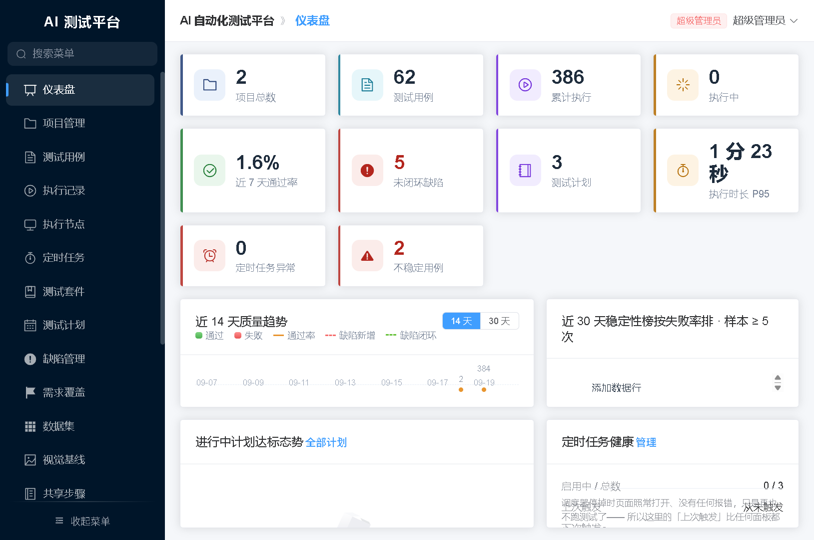 | 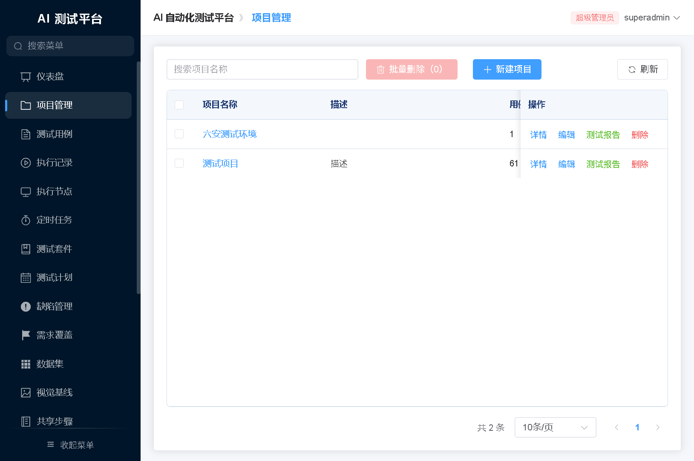 |
| **仪表盘** · 质量趋势 / 达标态势 / 定时任务健康 | **项目管理** · 多项目隔离与环境配置 |
| 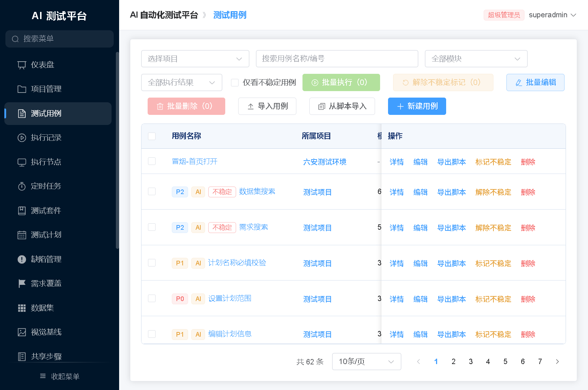 | 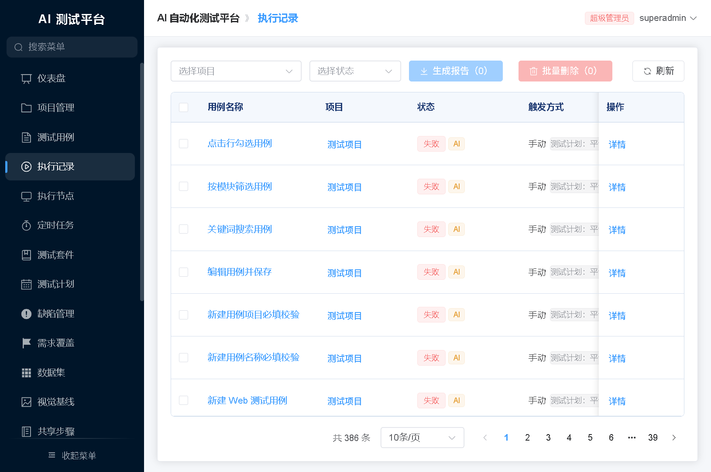 |
| **测试用例** · 优先级 / AI 生成标记 / 不稳定用例 | **执行记录** · 状态 / 触发方式 / AI 诊断入口 |
| 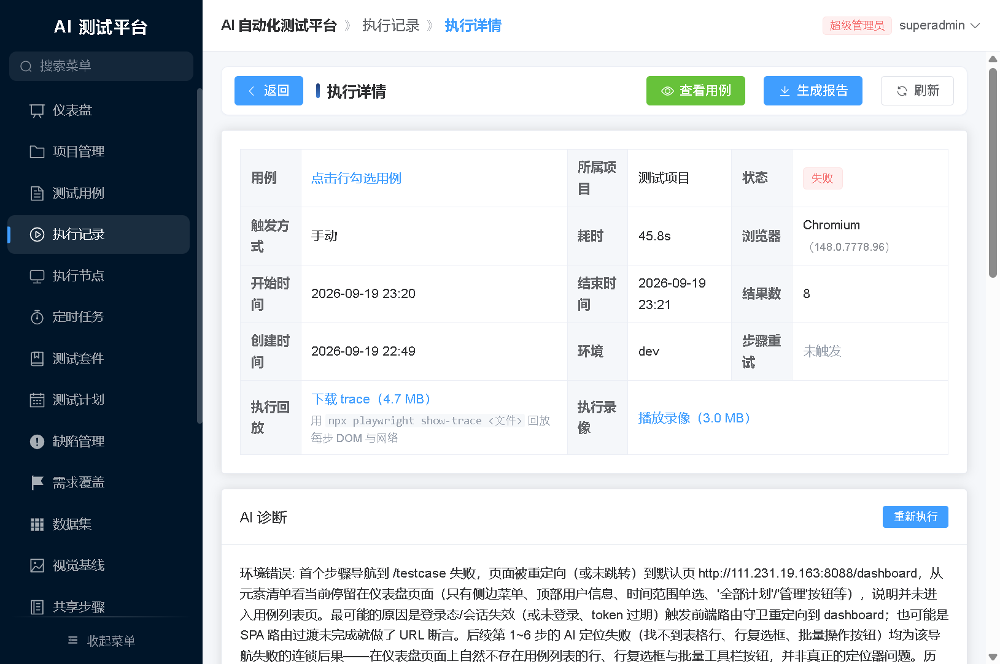 | 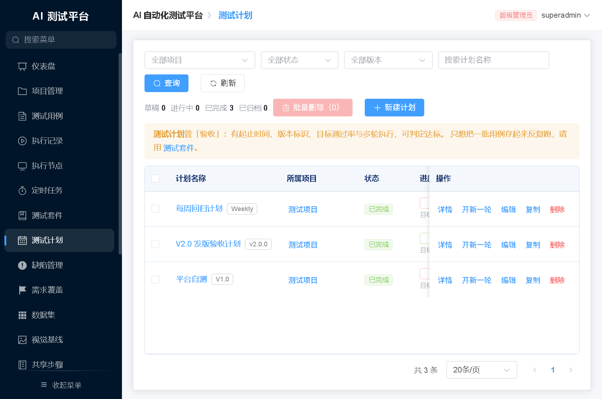 |
| **执行详情** · 步骤流 / trace 回放 / AI 根因分析 | **测试计划** · 版本标识 / 目标通过率 / 多轮执行 |
| 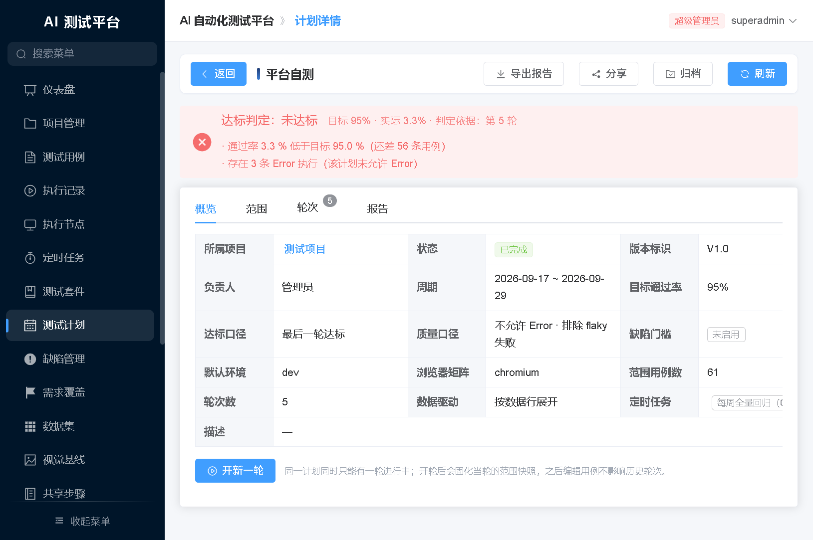 | 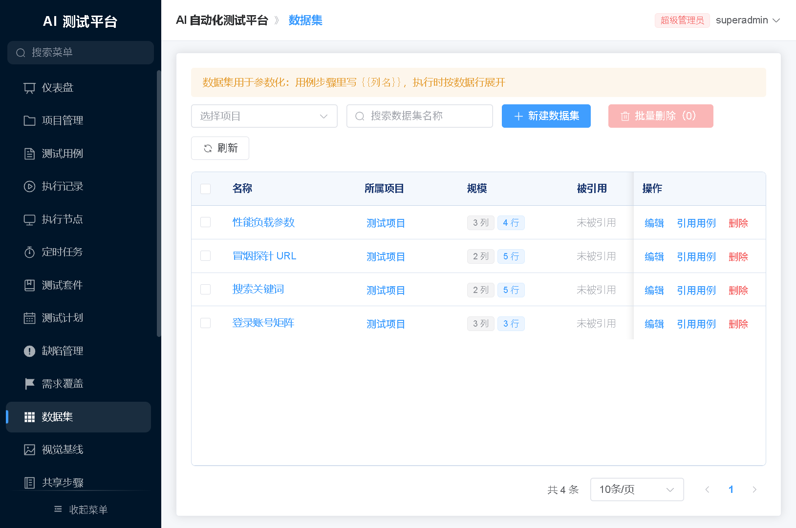 |
| **计划详情** · 达标判定 / 轮次 / 验收报告 | **数据集** · 数据驱动参数化（`{{变量}}`） |
| 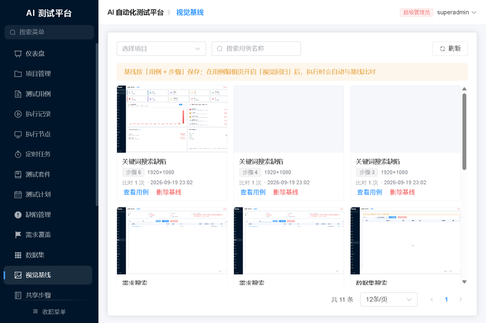 | 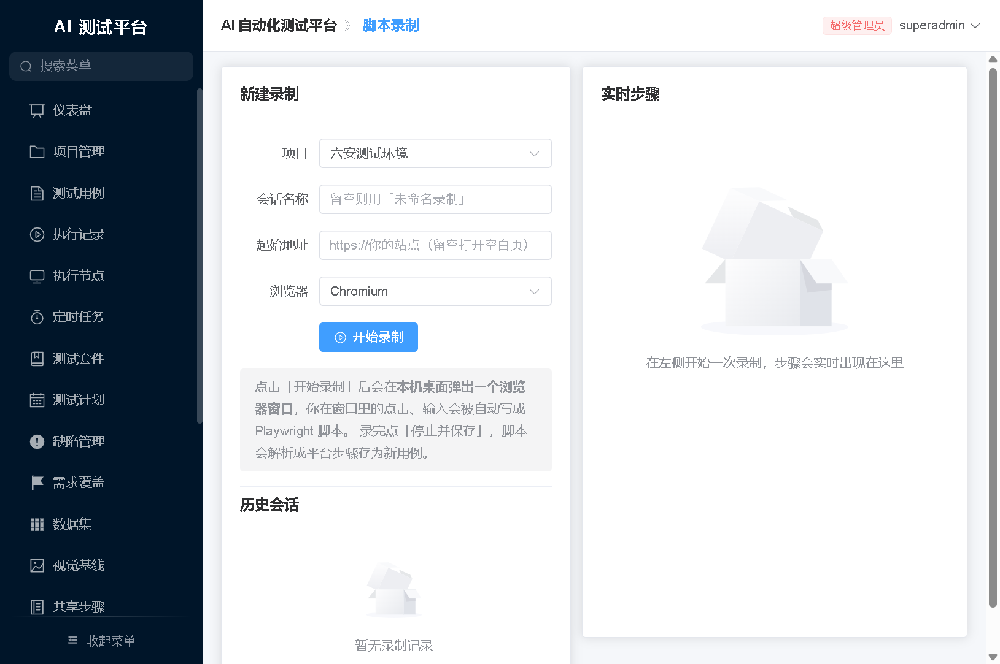 |
| **视觉基线** · 按「用例 + 步骤」保存基线截图 | **脚本录制** · 操作实时转 Playwright 步骤 |
| 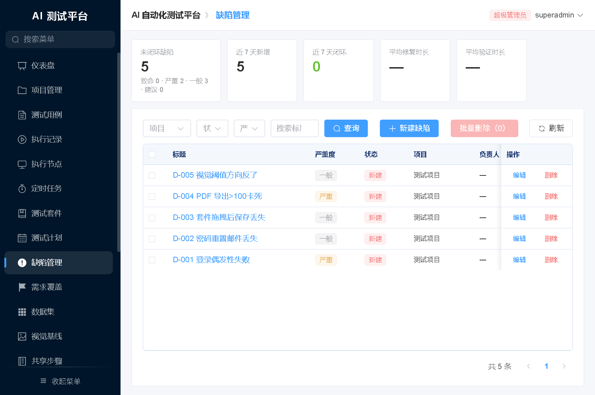 | 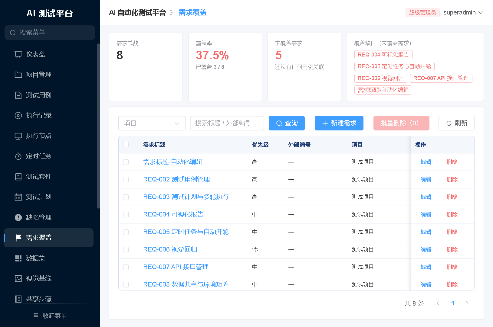 |
| **缺陷管理** · 失败步骤一键转缺陷 / 外部系统推送 | **需求覆盖** · 覆盖率与未覆盖需求追踪 |
| 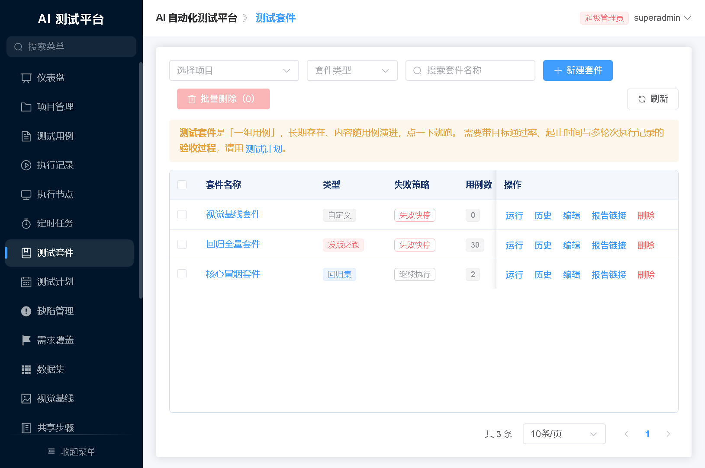 | 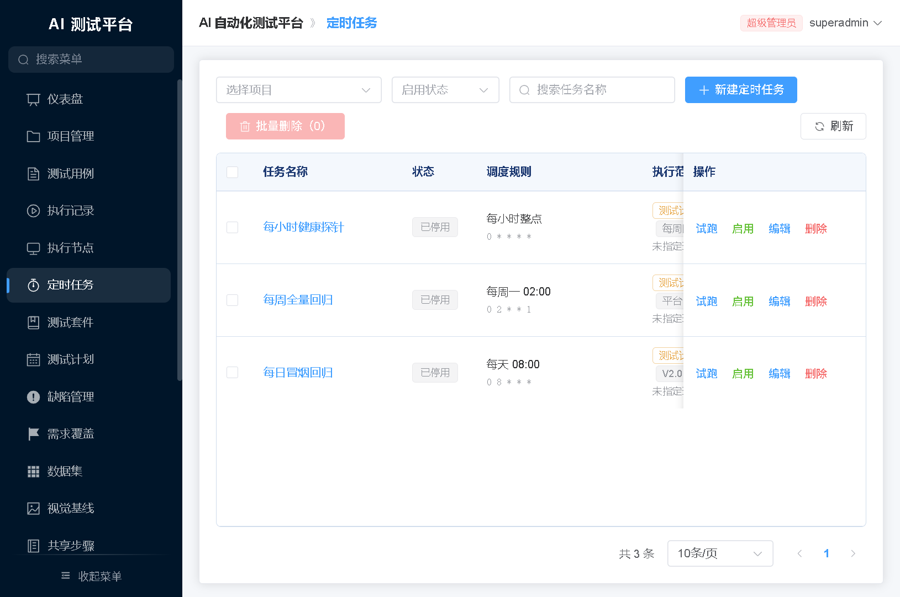 |
| **测试套件** · 用例归集 / 失败策略 / 一键运行 | **定时任务** · Cron 调度 + 执行范围编排 |
| 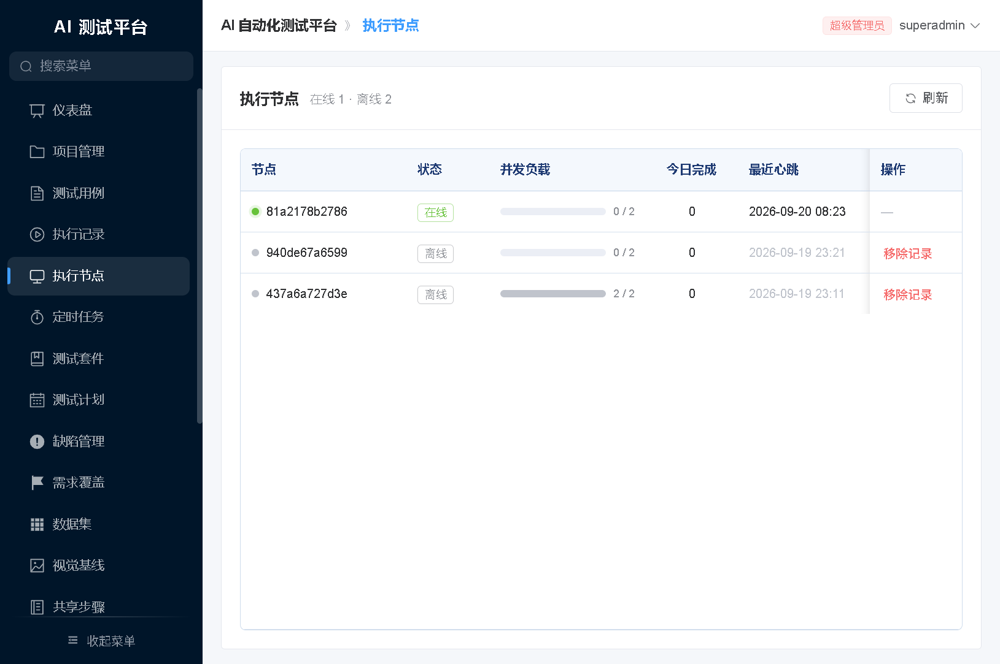 |  |
| **执行节点** · 分布式 Worker 在线状态与并发负载 |  |

## 🧰 技术栈

```
┌─────────────────────────────────────────────────────────────────┐
│                       TestPilot 技术架构                          │
├─────────────┬───────────────────┬───────────────────────────────┤
│  驾驶舱      │  引擎             │  辅助系统                      │
│  (前端/后端)  │  (执行/AI)       │  (数据/通信/部署)               │
├─────────────┼───────────────────┼───────────────────────────────┤
│ Vue 3 + TS  │ Playwright 1.60  │ PostgreSQL 18 + pgvector       │
│ Element Plus│ AIWorker (FastAPI)│ SignalR (实时推送)              │
│ Vite + Pinia│ DeepSeek LLM      │ Docker Compose                 │
│ .NET 8 API  │ WireMock.NET      │ Nginx (反代)                    │
│ EF Core 8   │ Pillow (视觉)     │ JWT + CORS                      │
│ Minimal API │ OpenApi Readers   │ Webhook Token                   │
└─────────────┴───────────────────┴───────────────────────────────┘
```

## 🚀 快速开始

### 前置条件

- **Windows + Git Bash**（或 Linux/macOS）
- **.NET SDK 8+**（构建与运行；开发环境以 SDK 9.0.310 验证）
- **Node.js 18+**、**Python 3.11+**
- **WSL2 + Docker Engine**（或本机 Docker Desktop）

### 一键启动

```bash
bash scripts/start-all.sh
# Windows 用户可双击 deploy\start.cmd
```

启动完成后：

| 服务 | 地址 |
|------|------|
| 🖥️ 前端页面 | http://localhost:3000 （账号 `admin / Admin@123456`） |
| 🔌 后端 API | http://localhost:5210 |
| 📖 Swagger | http://localhost:5210/swagger |
| 🤖 AIWorker | http://127.0.0.1:8000 |

### 常用命令

```bash
bash scripts/status.sh                 # 各服务健康检查
bash scripts/stop-all.sh               # 停止应用（保留数据库）
bash scripts/stop-all.sh --with-db     # 同时停止 PostgreSQL
bash scripts/build.sh                  # 只构建后端
bash scripts/build.sh test             # 构建 + 测试
bash scripts/build.sh migration <名称>  # 新增 EF 迁移
```

### 容器化部署（生产）

```bash
cd deploy
cp .env.example .env                   # 填写 4 个必填项
docker compose up -d --build
```

| 服务 | 端口 |
|------|------|
| frontend（唯一入口） | 8088 |
| backend API | 8002 |
| aiworker | 8001 |
| postgres（仅回环） | 5432 |

### 三条铁律别踩

1. **目标框架是 `net8.0`**：.NET 8 SDK 即可构建与运行；项目无 `global.json` 锁定，装更高版本 SDK（如 9.x）也能正常构建。
2. **`ALLOWED_ORIGINS` 必须逐字符匹配**：`http://localhost:3000` ≠ `http://127.0.0.1:3000`，填错 → 页面能开但所有接口 CORS 被拦。
3. **Playwright 浏览器版本**：容器化靠 `v1.60.0-noble` 镜像保证；裸机要 `playwright install --with-deps chromium firefox webkit`。

## 🐳 执行引擎

数据库抢占式并行——不靠进程内队列，而是靠 PostgreSQL：

```sql
UPDATE Executions
SET Status = 'Running', ClaimedBy = $node, HeartbeatAt = NOW()
WHERE Id = ANY(
    SELECT Id FROM Executions
    WHERE Status = 'Pending'
    ORDER BY CreatedAt
    LIMIT @batchSize
    FOR UPDATE SKIP LOCKED
    RETURNING Id
)
```

- 多实例水平扩展零配置：多个 Worker 同时启动，PostgreSQL 负责分任务，互不重复
- 心跳超时回收：Running 执行超过 `StaleRunningMinutes` 没心跳 → 自动回收为 Error（服务崩溃不遗留僵死任务）
- 并发度：`Execution:MaxConcurrency=0` 时自动 `max(2, 核数÷2)`

## 📐 目录结构

```
TestPilot/
├── backend/                    # .NET 8 后端
│   ├── src/
│   │   ├── AI.TestPlatform.Domain       # 实体与枚举
│   │   ├── AI.TestPlatform.Application  # DTO / 校验器 / 映射
│   │   ├── AI.TestPlatform.Infrastructure # EF Core + 迁移
│   │   ├── AI.TestPlatform.Api          # Minimal API + SignalR
│   │   └── AIWorker/                    # Python FastAPI AI Worker
│   └── tests/                   # 单元测试 + Testcontainers 集成
├── frontend/                   # Vue 3 前端
├── deploy/                     # 部署入口
│   ├── docker-compose.yml      # 全栈容器化
│   ├── .env.example            # 环境变量模板
│   ├── start.cmd               # Windows 一键启动（双击入口）
│   └── stop.cmd                # Windows 一键停止
└── scripts/                    # 启动/构建/迁移脚本
```

## 🧪 测试

```bash
# 后端（集成测试需 Docker）
dotnet test backend

# AI Worker
cd backend/src/AIWorker && python -m pytest tests/ -q

# 前端
cd frontend && npm run test && npm run type-check && npm run build
```

## 🗺️ 路线图

- ✅ **M1 基础平台搭建**
- ✅ **M2 核心测试能力**（Playwright 执行 / 可视化编辑器 / 报告）
- ✅ **M3 AI 用例生成**（文本需求 → 步骤）
- ✅ **M4 智能执行**（AI 定位自愈 / SignalR 实时流）
- ✅ **M5 接口测试**（Swagger 导入 / Mock / AI 业务流）
- ✅ **M6 诊断与优化**（AI 失败诊断 / CI Webhook / Flake 隔离）
- 🔜 **M7 企业特性**（SSO / 多租户 / 审计日志 / Grafana 仪表盘）
- 🔜 **M8 Agent 化**（LLM Agent 自主规划测试 → 执行 → 归因闭环）

## 🤝 贡献

欢迎 Issue、PR、讨论！开发前请先 `bash scripts/start-all.sh` 拉起本地环境。

## 📄 License

本项目基于 [MIT License](LICENSE) 开源——可自由使用、修改、分发（保留版权声明即可）。
生产环境配置（`appsettings.Production.json`、`deploy/.env`）不入仓库，请自行填写。
